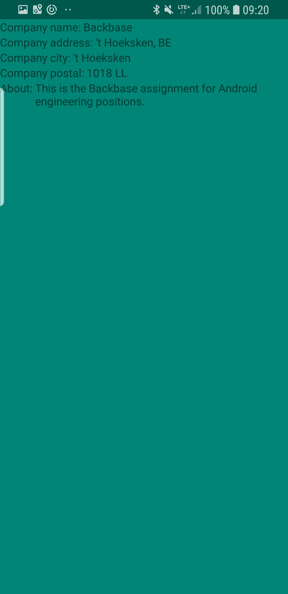
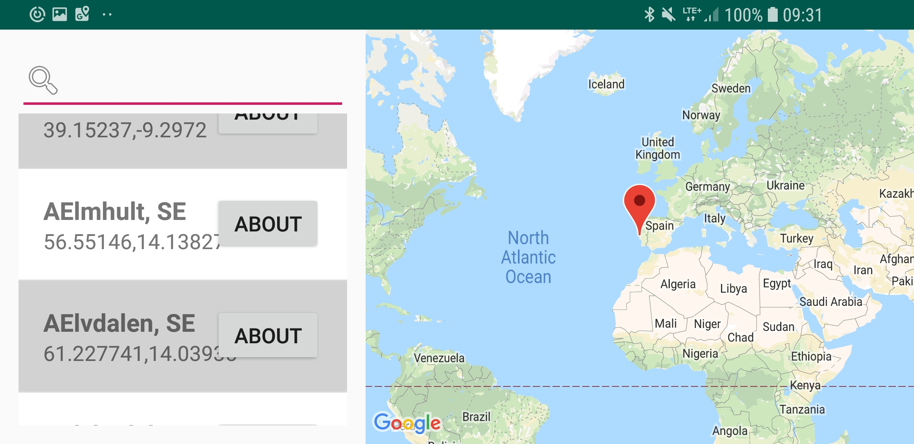
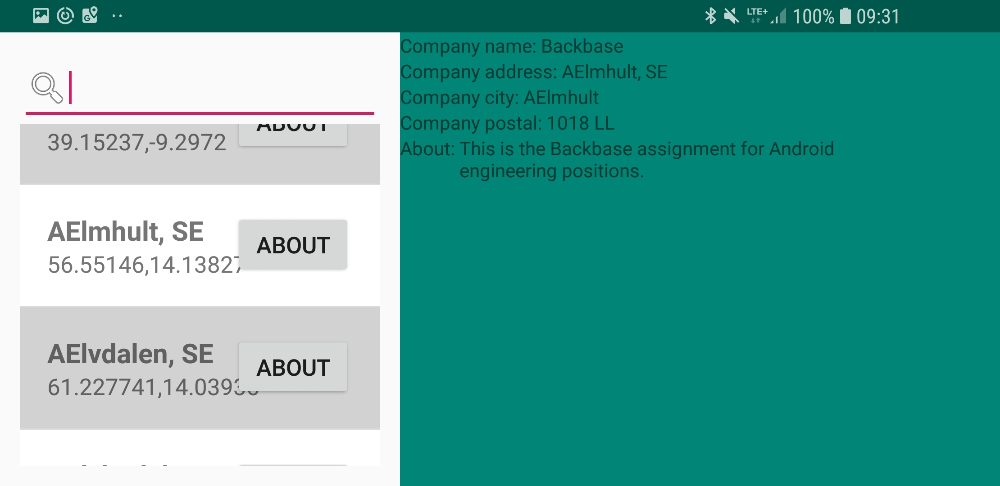

# backbase-CityFinder #

ThisApp is design by using MVP-Clean architecture

### What is this repository for? ###

This repository is about  searching city from database, show it on exact location on google map. This application is developed in Android supports from 4.4 Version.

## Demo:
This application works in both the orientation.
# Portrate #

# Landscape #

### What application Does ###
* Download the files from raw folder in res.
* Filtered the results by a given prefix string,
     * Optimised for fast searches.- Used Comparator for sorting and then used List view filter.
     * Search is case insensitive.
* list of cities are in Alphabetical order.

### How do I get set up? ###

You need to have android SDK with android studio on your machine.

### This project use this external libs ###

 * [Jackson](http://tutorials.jenkov.com/java-json/jackson-installation.html)

### This project was tested using  ###
* [Espresso](https://google.github.io/android-testing-support-library/docs/espresso/setup/)
 * [JUnit4](https://developer.android.com/training/testing/unit-testing/local-unit-tests.html)

### Who do I talk to? ###

* Developed by Praful Pijdurkar
* praful.pijdurkar@gmail.com
